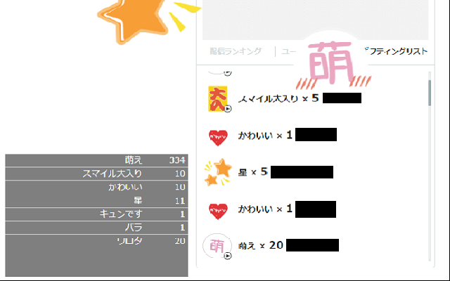

# マシェバラギフトカウンター

Chrome 拡張機能「マシェバラギフトカウンター」は、マシェバラのギフトをカウントする拡張機能です。

ギフティングリストに表示されているギフトの数を集計して表示します。

## インストール

### Chrome ウェブストア

※公開申請中※

### 手動インストール

* Release ページから extension.zip をダウンロード
* extension.zip を展開
* Chrome の拡張機能設定ページ chrome://extensions/ を開く
* デベロッパー モードを有効化する
* 「パッケージ化されていない拡張機能を読み込む」ボタンをクリックして、 extension.zip を展開したフォルダを指定する
