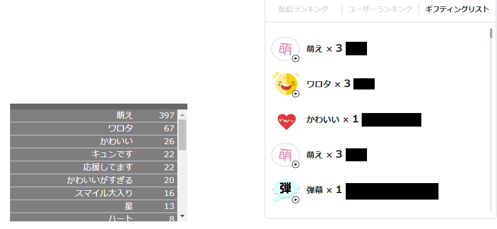

[](https://github.com/taigacat/mache-counter/actions/workflows/check.yml)
[](https://codecov.io/gh/taigacat/mache-counter)

# マシェバラギフトカウンター

Chrome 拡張機能「マシェバラギフトカウンター」は、マシェバラのギフトをカウントする拡張機能です。

ギフティングリストに表示されているギフトの数を集計して表示します。



## 利用方法

* [Chrome ストア](https://chrome.google.com/webstore/detail/mache-gift-counter/kgajfgfhobfpdkmjbpjblmcgcphbclkd?hl=ja) でインストールする
* マシェバラの配信ページを開く

## 開発者向け情報

### 環境構築

```sh
npm ci
```

### 静的解析

#### ESLint

```sh
npm run lint
```

自動修正する場合は、`npm run lint:fix` を実行する。

#### Stylelint

```sh
npm run stylelint
```

自動修正する場合は、`npm run stylelint:fix` を実行する。

### ユニットテスト

```sh
npm run test
```

### スナップショットテスト

```sh
npm run test:snapshot
```

スナップショットを更新する場合は、`npm run test:snapshot:update` を実行する。

### ビルド

```sh
npm run build
``` 
